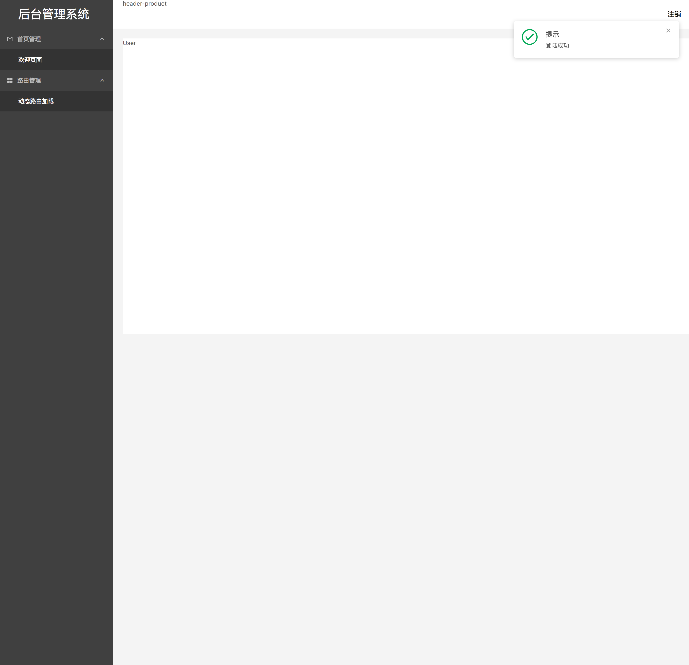

# React-Base

React脚手架，专门用作后台管理系统，方便修改，并且提供丰富的示例代码。

## 技术选型

* react
* redux
* react-router
* ant-design
* Immutable
* Fetch
* redux-action
* redux-logger
* classnames
* lodash
* webpack
* react-hot-loader

## 方便之处

* 主流技术选型，可以快速上手
* 已经实现登陆和主内容区，可以直接进行开发使用
* 配置齐全，使用方便
* Mock接口，可通过配置，自动生成测试数据接口
* 提供书写组件、reducer、action等的示例代码和sublime snippets，大大方便开发

## 使用方法

```bash
$ git clone git@github.com:mqyqingfeng/react-base.git
$ cd react-base
$ cnpm install                   # 需要安装cnpm

// 开发
$ npm start                     

// 访问locahost:5000可以预览页面

// 编译
$ npm run build

// 会在build目录下生成打包用的文件，可以访问locahost:3001预览页面

```


## 页面演示




