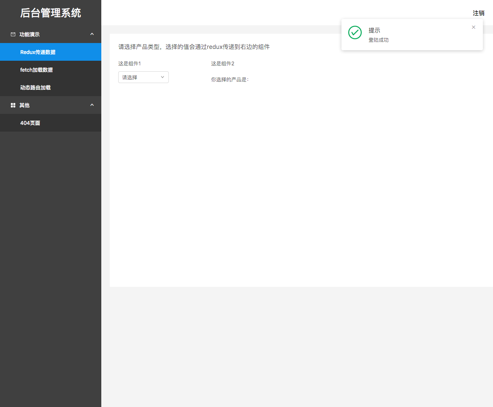
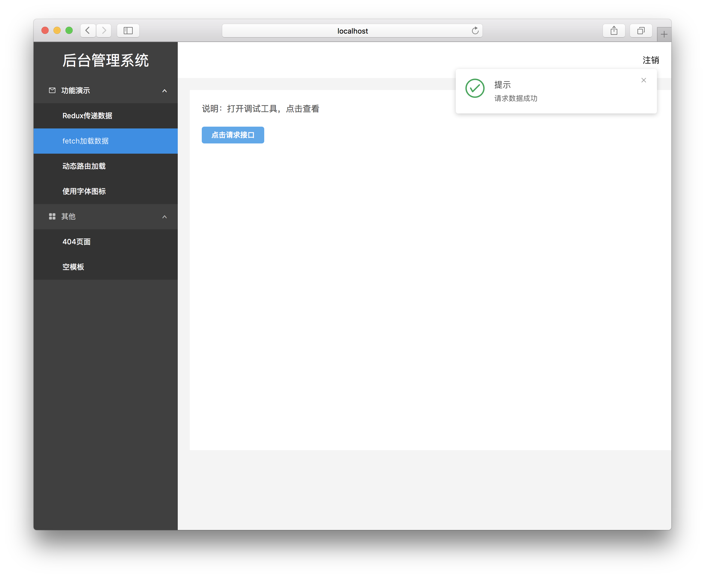
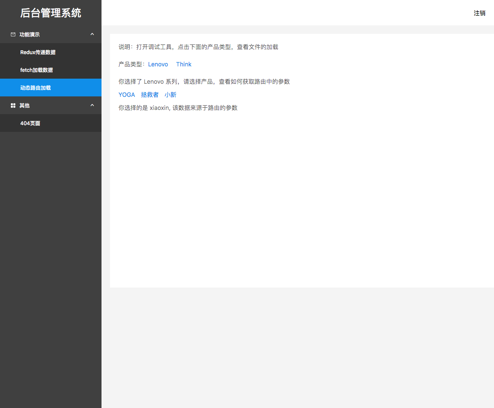
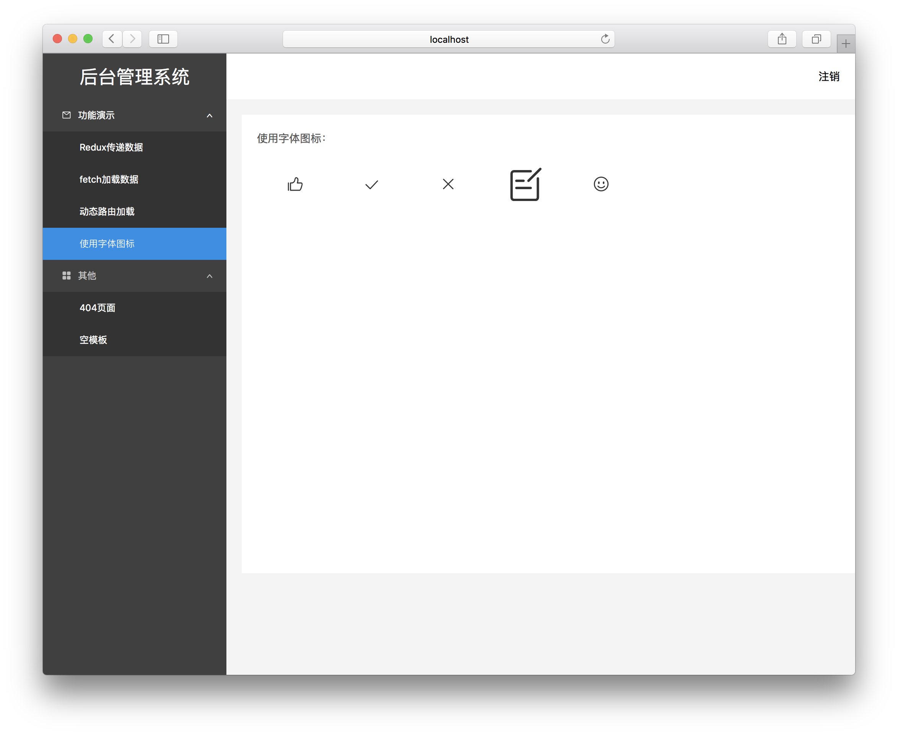

# React-Admin

React + Ant Design 脚手架，专用作后台管理系统，反复在项目中实践和优化，功能齐全，细节完善，并且提供丰富的示例代码，可以直接上手和开发。

## 技术选型

* react + redux + react-router + ant-design + Immutable + Fetch
* redux-action + redux-logger
* classnames + lodash
* sass
* webpack2 + react-hot-loader
* eslint

## 实现的功能

1. 热加载
2. ES6/7
3. 动态路由
4. action日志打印
5. 配置生成Mock接口
6. 本地node服务器
7. ESLint
8. Sass
9. postcss
10. fetch获取数据

## 更多特性

除了主流的技术选型之外，还提供了

1. 丰富的示例代码，包括：
    * 组件
    * Redux
    * fetch请求接口
    * 字体图标
    * 动态路由
2. 半完成的后台界面，细节丰富，包括
    * 登陆(可纯键盘操作登陆)
    * 菜单栏(菜单栏会随路由变化而激活不同的菜单)
    * 进入内容页会进行权限判断
    * 404页面
3. 提供sublime snippets，提高开发效率，包括创建：
    * action
    * reducers
    * component
    * fetch
    * mapDispatchToProps
    * mapStateToProps
4. ESLint

    配置可查看src/.eslintrc文件，规范遵循[Airbnb React规范](https://github.com/airbnb/javascript/tree/master/react)

    注意：为保证规范的执行，在出现不规范时，开发时会提示，编译时无法成功！

## 使用方法

```bash
$ git clone git@github.com:mqyqingfeng/react-admin.git
$ cd react-admin
$ cnpm install                   # 需要安装cnpm

// 开发
$ npm start                     

// 等待编译完成,然后访问locahost:5000预览页面

// 编译
$ npm run build

// 会在dist目录下生成打包用的文件，可以访问locahost:3001预览页面

```

如果想查看webpack1版本：

```bash
$ git clone git@github.com:mqyqingfeng/react-admin.git
$ cd react-admin
$ git checkout webpack1
$ cnpm install

//使用方法相同

```

## 页面展示

登录页面（账号、密码随意）：


Redux使用示例：



Fetch使用示例：



动态加载演示：



字体图标使用示例：



404页面：


